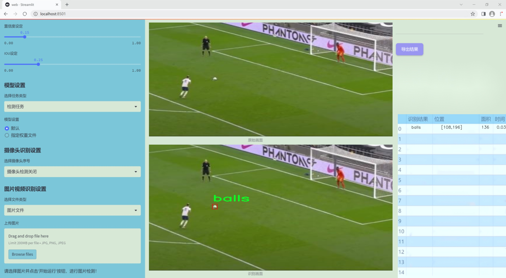
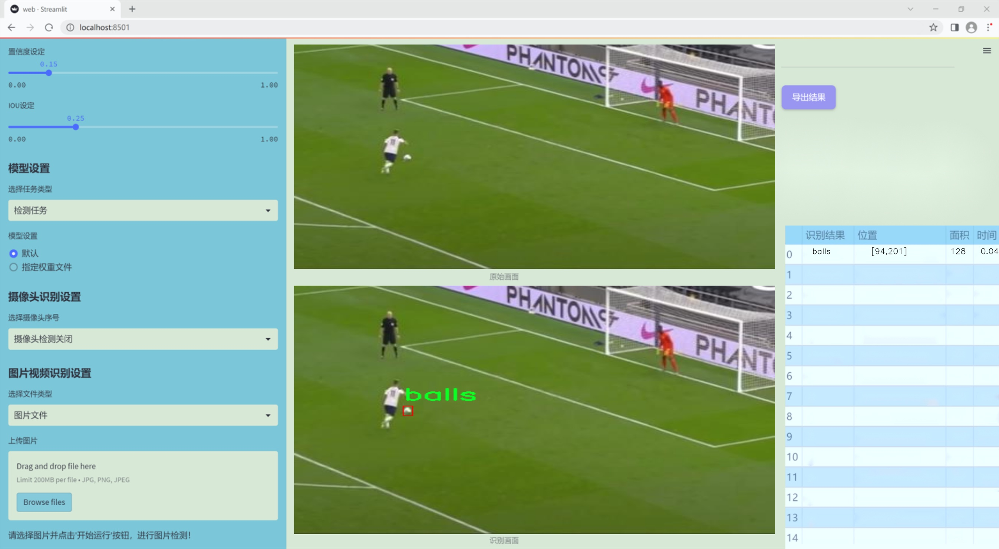
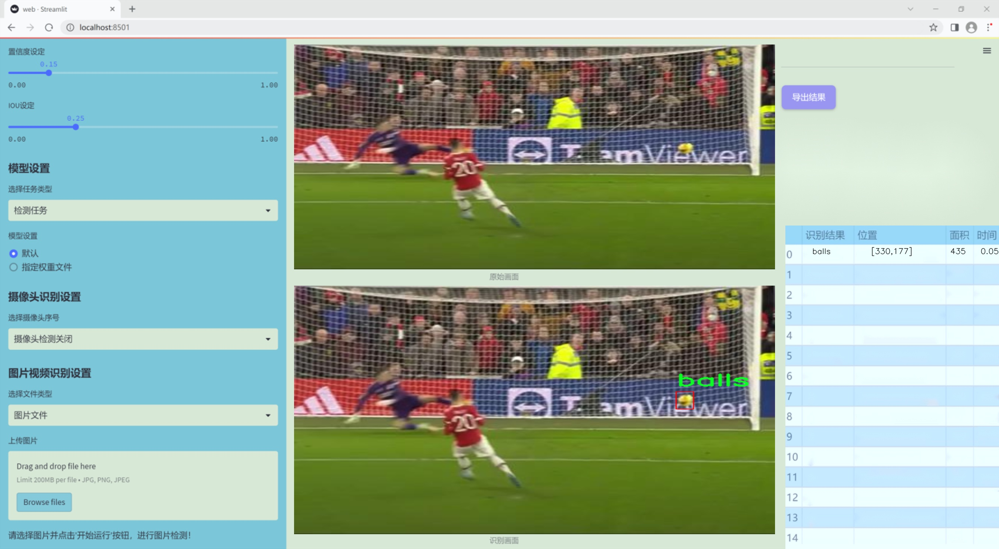
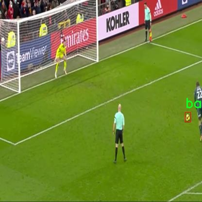
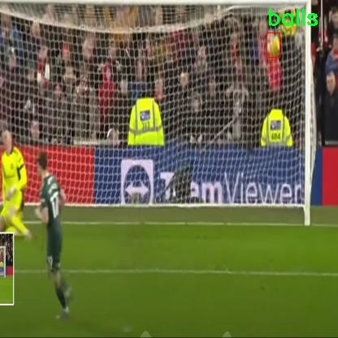
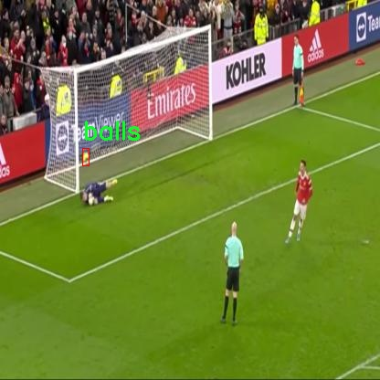
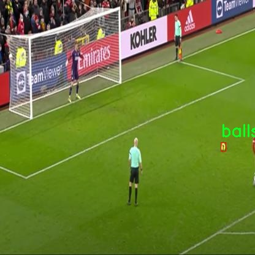
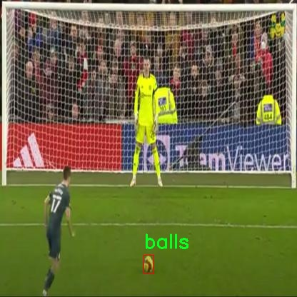

# 改进yolo11-EfficientHead等200+全套创新点大全：足球比赛点球场景射门检测系统源码＆数据集全套

### 1.图片效果展示







##### 项目来源 **[人工智能促进会 2024.11.01](https://kdocs.cn/l/cszuIiCKVNis)**

注意：由于项目一直在更新迭代，上面“1.图片效果展示”和“2.视频效果展示”展示的系统图片或者视频可能为老版本，新版本在老版本的基础上升级如下：（实际效果以升级的新版本为准）

  （1）适配了YOLOV11的“目标检测”模型和“实例分割”模型，通过加载相应的权重（.pt）文件即可自适应加载模型。

  （2）支持“图片识别”、“视频识别”、“摄像头实时识别”三种识别模式。

  （3）支持“图片识别”、“视频识别”、“摄像头实时识别”三种识别结果保存导出，解决手动导出（容易卡顿出现爆内存）存在的问题，识别完自动保存结果并导出到tempDir中。

  （4）支持Web前端系统中的标题、背景图等自定义修改。

  另外本项目提供训练的数据集和训练教程,暂不提供权重文件（best.pt）,需要您按照教程进行训练后实现图片演示和Web前端界面演示的效果。

### 2.视频效果展示

[2.1 视频效果展示](https://www.bilibili.com/video/BV1PPDwY2EdC/)

### 3.背景

研究背景与意义

在现代足球比赛中，点球是决定比赛胜负的重要环节，其准确判罚和及时反应对比赛的公平性和观赏性具有重要影响。随着计算机视觉技术的迅猛发展，基于深度学习的目标检测算法在体育赛事分析中展现出了巨大的潜力。YOLO（You Only Look Once）系列算法因其高效性和实时性，已成为目标检测领域的研究热点。特别是YOLOv11的推出，进一步提升了检测精度和速度，为复杂场景下的目标识别提供了新的解决方案。

本研究旨在基于改进的YOLOv11算法，构建一个专门针对足球比赛点球场景的射门检测系统。通过对107幅图像的分析，我们将重点关注点球时的球员动作、球的轨迹以及守门员的反应等关键要素。这一系统不仅能够实时识别点球过程中的重要事件，还能为后续的战术分析和比赛策略提供数据支持。

在数据集方面，虽然当前的图像数量相对较少，但通过改进YOLOv11的模型结构和训练策略，我们有望在有限的数据条件下实现较高的检测精度。此外，随着数据集的不断扩展和多样化，系统的适用性和准确性将进一步增强。通过对点球场景的深入研究，我们不仅能够提高比赛判罚的准确性，还能为教练和运动员提供科学的训练依据，推动足球运动的技术进步。

综上所述，基于改进YOLOv11的足球比赛点球场景射门检测系统的研究，不仅具有重要的理论价值，还有助于实际应用中的技术革新，推动体育赛事的智能化发展。

### 4.数据集信息展示

##### 4.1 本项目数据集详细数据（类别数＆类别名）

nc: 1
names: ['balls']


该项目为【目标检测】数据集，请在【训练教程和Web端加载模型教程（第三步）】这一步的时候按照【目标检测】部分的教程来训练

##### 4.2 本项目数据集信息介绍

本项目数据集信息介绍

本项目所使用的数据集名为“penalty”，专门针对足球比赛中的点球场景进行射门检测系统的训练与优化。该数据集的设计旨在提高YOLOv11模型在特定场景下的检测精度，尤其是在复杂的比赛环境中，能够有效识别和定位足球。数据集中包含的类别数量为1，具体类别为“balls”，这意味着数据集专注于足球这一单一目标，确保模型在识别和分析过程中能够集中精力于最重要的元素。

“penalty”数据集的构建过程涵盖了多种场景和角度，以确保模型在不同条件下的鲁棒性。数据集中的图像来源于真实的足球比赛，涵盖了多种天气条件、不同的比赛场地以及多样的光照环境。这种多样性不仅提高了数据集的代表性，也增强了模型在实际应用中的适应能力。此外，数据集中的图像经过精心标注，确保每个足球在图像中都被准确地框定，以便于YOLOv11模型进行有效的训练。

在训练过程中，模型将通过大量的图像数据学习足球的特征，进而提高其在点球场景中的检测性能。数据集的设计理念是为了解决传统检测系统在特定场景下的局限性，使得改进后的YOLOv11能够在瞬息万变的比赛环境中，快速且准确地识别出足球，从而为教练和分析师提供实时的比赛数据支持。通过对“penalty”数据集的深入研究与应用，本项目旨在推动足球比赛分析技术的发展，为未来的智能体育应用奠定基础。











### 5.全套项目环境部署视频教程（零基础手把手教学）

[5.1 所需软件PyCharm和Anaconda安装教程（第一步）](https://www.bilibili.com/video/BV1BoC1YCEKi/?spm_id_from=333.999.0.0&vd_source=bc9aec86d164b67a7004b996143742dc)


[5.2 安装Python虚拟环境创建和依赖库安装视频教程（第二步）](https://www.bilibili.com/video/BV1ZoC1YCEBw?spm_id_from=333.788.videopod.sections&vd_source=bc9aec86d164b67a7004b996143742dc)

### 6.改进YOLOv11训练教程和Web_UI前端加载模型教程（零基础手把手教学）

[6.1 改进YOLOv11训练教程和Web_UI前端加载模型教程（第三步）](https://www.bilibili.com/video/BV1BoC1YCEhR?spm_id_from=333.788.videopod.sections&vd_source=bc9aec86d164b67a7004b996143742dc)


按照上面的训练视频教程链接加载项目提供的数据集，运行train.py即可开始训练



     Epoch   gpu_mem       box       obj       cls    labels  img_size
     1/200     20.8G   0.01576   0.01955  0.007536        22      1280: 100%|██████████| 849/849 [14:42<00:00,  1.04s/it]
               Class     Images     Labels          P          R     mAP@.5 mAP@.5:.95: 100%|██████████| 213/213 [01:14<00:00,  2.87it/s]
                 all       3395      17314      0.994      0.957      0.0957      0.0843

     Epoch   gpu_mem       box       obj       cls    labels  img_size
     2/200     20.8G   0.01578   0.01923  0.007006        22      1280: 100%|██████████| 849/849 [14:44<00:00,  1.04s/it]
               Class     Images     Labels          P          R     mAP@.5 mAP@.5:.95: 100%|██████████| 213/213 [01:12<00:00,  2.95it/s]
                 all       3395      17314      0.996      0.956      0.0957      0.0845

     Epoch   gpu_mem       box       obj       cls    labels  img_size
     3/200     20.8G   0.01561    0.0191  0.006895        27      1280: 100%|██████████| 849/849 [10:56<00:00,  1.29it/s]
               Class     Images     Labels          P          R     mAP@.5 mAP@.5:.95: 100%|███████   | 187/213 [00:52<00:00,  4.04it/s]
                 all       3395      17314      0.996      0.957      0.0957      0.0845


###### [项目数据集下载链接](https://kdocs.cn/l/cszuIiCKVNis)

### 7.原始YOLOv11算法讲解

YOLOv11是一种由Ultralytics公司开发的最新一代目标检测模型，以其增强的特征提取能力和更高的效率在计算机视觉领域引人注目。该模型在架构上进行了关键升级，通过更新主干和颈部结构，显著提高了对复杂视觉场景的理解和处理精度。YOLOv11不仅在目标检测上表现出色，还支持实例分割、图像分类、姿态估计和定向目标检测（OBB）等任务，展示出其多功能性。

与其前身YOLOv8相比，YOLOv11在设计上实现了深度和宽度的改变，同时引入了几个创新机制。其中，C3k2机制是对YOLOv8中的C2f的改进，提升了浅层特征的处理能力；C2PSA机制则进一步优化了特征图的处理流程。解耦头的创新设计，通过增加两个深度卷积（DWConv），提高了模型对细节的感知能力和分类准确性。

在性能上，YOLOv11m模型在COCO数据集上的平均精度（mAP）提高，并减少了22%的参数量，确保了在运算效率上的突破。该模型可以部署在多种平台上，包括边缘设备、云平台以及支持NVIDIA GPU的系统，彰显出卓越的灵活性和适应性。总体而言，YOLOv11通过一系列的创新突破，对目标检测领域产生了深远的影响，并为未来的开发提供了新的研究方向。


****文档**** ： _ _https://docs.ultralytics.com/models/yolo11/__

****代码链接**** ： _ _https://github.com/ultralytics/ultralytics__

******Performance Metrics******


​ ** **关键特性****

****◆**** ** **增强的特征提取能力**** ：YOLO11采用了改进的主干和颈部架构，增强了 ** **特征提取****
能力，能够实现更精确的目标检测和复杂任务的执行。

****◆**** ** **优化的效率和速度****
：YOLO11引入了精细化的架构设计和优化的训练流程，提供更快的处理速度，并在准确性和性能之间保持最佳平衡。

****◆**** ** **参数更少、精度更高****
：通过模型设计的改进，YOLO11m在COCO数据集上实现了更高的平均精度（mAP），同时使用的参数比YOLOv8m少22%，使其在计算上更加高效，而不牺牲准确性。

****◆**** ** **跨环境的适应性**** ：YOLO11可以无缝部署在各种环境中，包括边缘设备、云平台和支持NVIDIA
GPU的系统，确保最大的灵活性。

****◆**** ** **支持广泛任务****
：无论是目标检测、实例分割、图像分类、姿态估计还是定向目标检测（OBB），YOLO11都旨在应对一系列计算机视觉挑战。

****支持的任务和模式****


​YOLO11建立在YOLOv8中引入的多功能模型范围之上，为各种计算机视觉任务提供增强的支持:


​该表提供了YOLO11模型变体的概述，展示了它们在特定任务中的适用性以及与Inference、Validation、Training和Export等操作模式的兼容性。从实时检测到复杂的分割任务
，这种灵活性使YOLO11适用于计算机视觉的广泛应用。

##### yolov11的创新

■ yolov8 VS yolov11

YOLOv5，YOLOv8和YOLOv11均是ultralytics公司的作品，ultralytics出品必属精品。


​ **具体创新点** ：

**① 深度（depth）和宽度 （width）**

YOLOv8和YOLOv11是基本上完全不同。

**② C3k2机制**

C3k2有参数为c3k，其中在网络的浅层c3k设置为False。C3k2就相当于YOLOv8中的C2f。


​ **③ C2PSA机制**

下图为C2PSA机制的原理图。


​ **④ 解耦头**

解耦头中的分类检测头增加了两个 **DWConv** 。


▲Conv

    
    
    def autopad(k, p=None, d=1):  # kernel, padding, dilation
    
        """Pad to 'same' shape outputs."""
    
        if d > 1:
    
            k = d * (k - 1) + 1 if isinstance(k, int) else [d * (x - 1) + 1 for x in k]  # actual kernel-size
    
        if p is None:
    
            p = k // 2 if isinstance(k, int) else [x // 2 for x in k]  # auto-pad
    
    return p
    
    
    class Conv(nn.Module):
    
        """Standard convolution with args(ch_in, ch_out, kernel, stride, padding, groups, dilation, activation)."""
    
    
        default_act = nn.SiLU()  # default activation
    
    
        def __init__(self, c1, c2, k=1, s=1, p=None, g=1, d=1, act=True):
    
            """Initialize Conv layer with given arguments including activation."""
    
            super().__init__()
    
            self.conv = nn.Conv2d(c1, c2, k, s, autopad(k, p, d), groups=g, dilation=d, bias=False)
    
            self.bn = nn.BatchNorm2d(c2)
    
            self.act = self.default_act if act is True else act if isinstance(act, nn.Module) else nn.Identity()
    
    
        def forward(self, x):
    
            """Apply convolution, batch normalization and activation to input tensor."""
    
            return self.act(self.bn(self.conv(x)))
    
    
        def forward_fuse(self, x):
    
            """Perform transposed convolution of 2D data."""
    
            return self.act(self.conv(x))

▲Conv2d

    
    
    torch.nn.Conv2d(in_channels, out_channels, kernel_size, stride=1, padding=0, dilation=1, groups=1, bias=True, padding_mode='zeros')

▲DWConv

DWConv ** **代表 Depthwise Convolution（深度卷积）****
，是一种在卷积神经网络中常用的高效卷积操作。它主要用于减少计算复杂度和参数量。

    
    
    class DWConv(Conv):
    
        """Depth-wise convolution."""
    
    
        def __init__(self, c1, c2, k=1, s=1, d=1, act=True):  # ch_in, ch_out, kernel, stride, dilation, activation
    
            """Initialize Depth-wise convolution with given parameters."""
    
            super().__init__(c1, c2, k, s, g=math.gcd(c1, c2), d=d, act=act)


### 8.200+种全套改进YOLOV11创新点原理讲解

#### 8.1 200+种全套改进YOLOV11创新点原理讲解大全

由于篇幅限制，每个创新点的具体原理讲解就不全部展开，具体见下列网址中的改进模块对应项目的技术原理博客网址【Blog】（创新点均为模块化搭建，原理适配YOLOv5~YOLOv11等各种版本）

[改进模块技术原理博客【Blog】网址链接](https://gitee.com/qunmasj/good)


#### 8.2 精选部分改进YOLOV11创新点原理讲解

###### 这里节选部分改进创新点展开原理讲解(完整的改进原理见上图和[改进模块技术原理博客链接](https://gitee.com/qunmasj/good)【如果此小节的图加载失败可以通过CSDN或者Github搜索该博客的标题访问原始博客，原始博客图片显示正常】


### YOLO-MS简介
实时目标检测，以YOLO系列为例，已在工业领域中找到重要应用，特别是在边缘设备（如无人机和机器人）中。与之前的目标检测器不同，实时目标检测器旨在在速度和准确性之间追求最佳平衡。为了实现这一目标，提出了大量的工作：从第一代DarkNet到CSPNet，再到最近的扩展ELAN，随着性能的快速增长，实时目标检测器的架构经历了巨大的变化。

尽管性能令人印象深刻，但在不同尺度上识别对象仍然是实时目标检测器面临的基本挑战。这促使作者设计了一个强大的编码器架构，用于学习具有表现力的多尺度特征表示。具体而言，作者从两个新的角度考虑为实时目标检测编码多尺度特征：

从局部视角出发，作者设计了一个具有简单而有效的分层特征融合策略的MS-Block。受到Res2Net的启发，作者在MS-Block中引入了多个分支来进行特征提取，但不同的是，作者使用了一个带有深度卷积的 Inverted Bottleneck Block块，以实现对大Kernel的高效利用。

从全局视角出发，作者提出随着网络加深逐渐增加卷积的Kernel-Size。作者在浅层使用小Kernel卷积来更高效地处理高分辨率特征。另一方面，在深层中，作者采用大Kernel卷积来捕捉广泛的信息。

基于以上设计原则，作者呈现了作者的实时目标检测器，称为YOLO-MS。为了评估作者的YOLO-MS的性能，作者在MS COCO数据集上进行了全面的实验。还提供了与其他最先进方法的定量比较，以展示作者方法的强大性能。如图1所示，YOLO-MS在计算性能平衡方面优于其他近期的实时目标检测器。


具体而言，YOLO-MS-XS在MS COCO上获得了43%+的AP得分，仅具有450万个可学习参数和8.7亿个FLOPs。YOLO-MS-S和YOLO-MS分别获得了46%+和51%+的AP，可学习参数分别为810万和2220万。此外，作者的工作还可以作为其他YOLO模型的即插即用模块。通常情况下，作者的方法可以将YOLOv11的AP从37%+显著提高到40%+，甚至还可以使用更少的参数和FLOPs。


#### Multi-Scale Building Block Design
CSP Block是一个基于阶段级梯度路径的网络，平衡了梯度组合和计算成本。它是广泛应用于YOLO系列的基本构建块。已经提出了几种变体，包括YOLOv4和YOLOv11中的原始版本，Scaled YOLOv4中的CSPVoVNet，YOLOv11中的ELAN，以及RTMDet中提出的大Kernel单元。作者在图2(a)和图2(b)中分别展示了原始CSP块和ELAN的结构。


上述实时检测器中被忽视的一个关键方面是如何在基本构建块中编码多尺度特征。其中一个强大的设计原则是Res2Net，它聚合了来自不同层次的特征以增强多尺度表示。然而，这一原则并没有充分探索大Kernel卷积的作用，而大Kernel卷积已经在基于CNN的视觉识别任务模型中证明有效。将大Kernel卷积纳入Res2Net的主要障碍在于它们引入的计算开销，因为构建块采用了标准卷积。在作者的方法中，作者提出用 Inverted Bottleneck Block替代标准的3 × 3卷积，以享受大Kernel卷积的好处。

基于前面的分析，作者提出了一个带有分层特征融合策略的全新Block，称为MS-Block，以增强实时目标检测器在提取多尺度特征时的能力，同时保持快速的推理速度。

MS-Block的具体结构如图2(c)所示。假设是输入特征。通过1×1卷积的转换后，X的通道维度增加到n*C。然后，作者将X分割成n个不同的组，表示为，其中。为了降低计算成本，作者选择n为3。

注意，除了之外，每个其他组都经过一个 Inverted Bottleneck Block层，用表示，其中k表示Kernel-Size，以获得。的数学表示如下：


根据这个公式，该博客的作者不将 Inverted Bottleneck Block层连接，使其作为跨阶段连接，并保留来自前面层的信息。最后，作者将所有分割连接在一起，并应用1×1卷积来在所有分割之间进行交互，每个分割都编码不同尺度的特征。当网络加深时，这个1×1卷积也用于调整通道数。

#### Heterogeneous Kernel Selection Protocol
除了构建块的设计外，作者还从宏观角度探讨了卷积的使用。之前的实时目标检测器在不同的编码器阶段采用了同质卷积（即具有相同Kernel-Size的卷积），但作者认为这不是提取多尺度语义信息的最佳选项。

在金字塔结构中，从检测器的浅阶段提取的高分辨率特征通常用于捕捉细粒度语义，将用于检测小目标。相反，来自网络较深阶段的低分辨率特征用于捕捉高级语义，将用于检测大目标。如果作者在所有阶段都采用统一的小Kernel卷积，深阶段的有效感受野（ERF）将受到限制，影响大目标的性能。在每个阶段中引入大Kernel卷积可以帮助解决这个问题。然而，具有大的ERF的大Kernel可以编码更广泛的区域，这增加了在小目标外部包含噪声信息的概率，并且降低了推理速度。

在这项工作中，作者建议在不同阶段中采用异构卷积，以帮助捕获更丰富的多尺度特征。具体来说，在编码器的第一个阶段中，作者采用最小Kernel卷积，而最大Kernel卷积位于最后一个阶段。随后，作者逐步增加中间阶段的Kernel-Size，使其与特征分辨率的增加保持一致。这种策略允许提取细粒度和粗粒度的语义信息，增强了编码器的多尺度特征表示能力。

正如图所示，作者将k的值分别分配给编码器中的浅阶段到深阶段，取值为3、5、7和9。作者将其称为异构Kernel选择（HKS）协议。


作者的HKS协议能够在深层中扩大感受野，而不会对浅层产生任何其他影响。此外，HKS不仅有助于编码更丰富的多尺度特征，还确保了高效的推理。

如表1所示，将大Kernel卷积应用于高分辨率特征会产生较高的计算开销。然而，作者的HKS协议在低分辨率特征上采用大Kernel卷积，从而与仅使用大Kernel卷积相比，大大降低了计算成本。


在实践中，作者经验性地发现，采用HKS协议的YOLO-MS的推理速度几乎与仅使用深度可分离的3 × 3卷积相同。

#### Architecture
如图所示，作者模型的Backbone由4个阶段组成，每个阶段后面跟随1个步长为2的3 × 3卷积进行下采样。在第3个阶段后，作者添加了1个SPP块，与RTMDet中一样。在作者的编码器上，作者使用PAFPN作为Neck来构建特征金字塔[31, 35]。它融合了从Backbone不同阶段提取的多尺度特征。Neck中使用的基本构建块也是作者的MS-Block，在其中使用3 × 3深度可分离卷积进行快速推理。

此外，为了在速度和准确性之间取得更好的平衡，作者将Backbone中多级特征的通道深度减半。作者提供了3个不同尺度的YOLO-MS变体，即YOLO-MS-XS、YOLO-MS-S和YOLO-MS。不同尺度的YOLO-MS的详细配置列在表2中。对于YOLO-MS的其他部分，作者将其保持与RTMDet相同。


### 9.系统功能展示

图9.1.系统支持检测结果表格显示

  图9.2.系统支持置信度和IOU阈值手动调节

  图9.3.系统支持自定义加载权重文件best.pt(需要你通过步骤5中训练获得)

  图9.4.系统支持摄像头实时识别

  图9.5.系统支持图片识别

  图9.6.系统支持视频识别

  图9.7.系统支持识别结果文件自动保存

  图9.8.系统支持Excel导出检测结果数据


### 10. YOLOv11核心改进源码讲解

#### 10.1 FreqFusion.py

以下是对代码中最核心部分的分析和详细注释，保留了必要的功能和结构。

```python
import torch
import torch.nn as nn
import torch.nn.functional as F

class FreqFusion(nn.Module):
    def __init__(self, channels, scale_factor=1, lowpass_kernel=5, highpass_kernel=3, **kwargs):
        super().__init__()
        hr_channels, lr_channels = channels
        self.scale_factor = scale_factor
        self.lowpass_kernel = lowpass_kernel
        self.highpass_kernel = highpass_kernel
        
        # 压缩高分辨率和低分辨率特征通道
        self.compressed_channels = (hr_channels + lr_channels) // 8
        self.hr_channel_compressor = nn.Conv2d(hr_channels, self.compressed_channels, 1)
        self.lr_channel_compressor = nn.Conv2d(lr_channels, self.compressed_channels, 1)

        # 内容编码器，用于生成低通和高通滤波器
        self.content_encoder = nn.Conv2d(
            self.compressed_channels,
            lowpass_kernel ** 2 * self.scale_factor * self.scale_factor,
            kernel_size=3,
            padding=1
        )
        self.content_encoder2 = nn.Conv2d(
            self.compressed_channels,
            highpass_kernel ** 2 * self.scale_factor * self.scale_factor,
            kernel_size=3,
            padding=1
        )

    def kernel_normalizer(self, mask, kernel):
        """
        归一化卷积核，确保其和为1
        """
        mask = F.softmax(mask, dim=1)  # 对mask进行softmax处理
        mask = mask.view(-1, kernel, kernel)  # 重塑为卷积核形状
        mask /= mask.sum(dim=(-1, -2), keepdims=True)  # 归一化
        return mask

    def forward(self, x):
        hr_feat, lr_feat = x  # 输入的高分辨率和低分辨率特征
        
        # 压缩特征
        compressed_hr_feat = self.hr_channel_compressor(hr_feat)
        compressed_lr_feat = self.lr_channel_compressor(lr_feat)

        # 生成低通和高通滤波器
        mask_lr = self.content_encoder(compressed_lr_feat)
        mask_hr = self.content_encoder2(compressed_hr_feat)

        # 归一化滤波器
        mask_lr = self.kernel_normalizer(mask_lr, self.lowpass_kernel)
        mask_hr = self.kernel_normalizer(mask_hr, self.highpass_kernel)

        # 使用卷积核对特征进行滤波
        lr_feat = F.conv2d(lr_feat, mask_lr, padding=self.lowpass_kernel // 2)
        hr_feat = F.conv2d(hr_feat, mask_hr, padding=self.highpass_kernel // 2)

        return hr_feat + lr_feat  # 返回融合后的特征

# 示例使用
# freq_fusion = FreqFusion(channels=(64, 32))
# output = freq_fusion((high_res_input, low_res_input))
```

### 代码核心部分分析
1. **FreqFusion类**: 这是一个神经网络模块，主要用于频率感知特征融合。它接受高分辨率和低分辨率的特征图，并通过低通和高通滤波器进行处理。
  
2. **初始化方法**: 
   - `hr_channel_compressor`和`lr_channel_compressor`用于将高分辨率和低分辨率特征压缩到相同的通道数，以便后续处理。
   - `content_encoder`和`content_encoder2`分别用于生成低通和高通滤波器。

3. **kernel_normalizer方法**: 该方法对生成的卷积核进行归一化处理，确保其和为1，以保持信号的能量。

4. **forward方法**: 
   - 接收高分辨率和低分辨率特征图。
   - 通过压缩器和编码器生成压缩特征和滤波器。
   - 使用卷积操作对输入特征进行滤波，并返回融合后的特征。

### 总结
以上代码实现了一个频率感知特征融合的模块，能够有效地结合高分辨率和低分辨率的特征信息，适用于图像预测等任务。

这个文件 `FreqFusion.py` 实现了一个名为 `FreqFusion` 的深度学习模块，主要用于密集图像预测中的频率感知特征融合。该模块使用 PyTorch 框架，包含了一些卷积操作、特征重采样和窗口函数等功能，旨在提升图像处理任务的效果。

首先，文件导入了必要的库，包括 PyTorch 和一些数学操作的库。接着，定义了一些初始化函数，如 `normal_init` 和 `constant_init`，用于对神经网络层的权重和偏置进行初始化。这些初始化方法可以帮助模型在训练初期保持稳定性。

`resize` 函数用于调整输入张量的大小，支持多种插值模式，并在特定条件下发出警告，以确保输出的对齐方式正确。`hamming2D` 函数则生成一个二维 Hamming 窗，通常用于信号处理中的窗函数，以减少频谱泄漏。

接下来是 `FreqFusion` 类的定义，这是该模块的核心部分。它的构造函数接收多个参数，包括通道数、缩放因子、低通和高通卷积核的大小等。该类的主要功能是将高分辨率（HR）和低分辨率（LR）特征进行融合，生成更高质量的输出特征。

在构造函数中，定义了多个卷积层和参数，包括用于特征压缩的卷积层、内容编码器等。`hamming_window` 参数用于控制是否使用 Hamming 窗，帮助在特征融合时进行正则化。`init_weights` 方法用于初始化网络中的权重，确保网络在训练开始时的稳定性。

`kernel_normalizer` 方法用于对卷积核进行归一化处理，以确保其和为1，避免在卷积操作中引入偏差。`forward` 方法是模块的前向传播逻辑，接收高分辨率和低分辨率特征，进行融合处理。它支持使用检查点机制来节省内存。

在 `_forward` 方法中，首先对输入特征进行压缩，然后根据设定的参数决定如何进行特征融合。如果启用了半卷积（`semi_conv`），则使用特定的卷积和重采样方法来处理特征；否则，简单地将压缩后的特征进行插值和相加。最终，返回融合后的高分辨率特征。

此外，文件中还定义了 `LocalSimGuidedSampler` 类，用于生成特征重采样的偏移量。该类使用局部相似性来指导重采样过程，以便在高分辨率和低分辨率特征之间进行更精确的映射。

最后，`compute_similarity` 函数用于计算输入张量中每个点与其周围点的余弦相似度，这在特征重采样过程中非常重要。

整体来看，`FreqFusion.py` 文件实现了一个复杂的图像特征融合模块，结合了频率域的处理和深度学习技术，旨在提高图像预测任务的性能。

#### 10.2 conv.py

以下是经过简化和注释的核心代码部分，主要包含卷积相关的模块和注意力机制的实现：

```python
import math
import torch
import torch.nn as nn

def autopad(k, p=None, d=1):
    """自动计算填充以保持输出形状与输入相同。"""
    if d > 1:
        k = d * (k - 1) + 1 if isinstance(k, int) else [d * (x - 1) + 1 for x in k]  # 计算实际的卷积核大小
    if p is None:
        p = k // 2 if isinstance(k, int) else [x // 2 for x in k]  # 默认填充为卷积核大小的一半
    return p

class Conv(nn.Module):
    """标准卷积层，包含卷积、批归一化和激活函数。"""

    default_act = nn.SiLU()  # 默认激活函数

    def __init__(self, c1, c2, k=1, s=1, p=None, g=1, d=1, act=True):
        """初始化卷积层，设置输入输出通道、卷积核大小、步幅、填充等参数。"""
        super().__init__()
        self.conv = nn.Conv2d(c1, c2, k, s, autopad(k, p, d), groups=g, dilation=d, bias=False)  # 卷积层
        self.bn = nn.BatchNorm2d(c2)  # 批归一化层
        self.act = self.default_act if act is True else act if isinstance(act, nn.Module) else nn.Identity()  # 激活函数

    def forward(self, x):
        """前向传播：执行卷积、批归一化和激活。"""
        return self.act(self.bn(self.conv(x)))

class DWConv(Conv):
    """深度可分离卷积层。"""

    def __init__(self, c1, c2, k=1, s=1, d=1, act=True):
        """初始化深度卷积层，设置输入输出通道、卷积核大小、步幅等参数。"""
        super().__init__(c1, c2, k, s, g=math.gcd(c1, c2), d=d, act=act)  # 使用通道数的最大公约数作为组数

class ChannelAttention(nn.Module):
    """通道注意力模块。"""

    def __init__(self, channels: int) -> None:
        """初始化通道注意力模块，设置池化和全连接层。"""
        super().__init__()
        self.pool = nn.AdaptiveAvgPool2d(1)  # 自适应平均池化
        self.fc = nn.Conv2d(channels, channels, 1, 1, 0, bias=True)  # 1x1卷积
        self.act = nn.Sigmoid()  # Sigmoid激活函数

    def forward(self, x: torch.Tensor) -> torch.Tensor:
        """前向传播：计算通道注意力并应用于输入。"""
        return x * self.act(self.fc(self.pool(x)))  # 将输入与注意力权重相乘

class SpatialAttention(nn.Module):
    """空间注意力模块。"""

    def __init__(self, kernel_size=7):
        """初始化空间注意力模块，设置卷积核大小。"""
        super().__init__()
        assert kernel_size in {3, 7}, "kernel size must be 3 or 7"  # 限制卷积核大小
        padding = 3 if kernel_size == 7 else 1
        self.cv1 = nn.Conv2d(2, 1, kernel_size, padding=padding, bias=False)  # 卷积层
        self.act = nn.Sigmoid()  # Sigmoid激活函数

    def forward(self, x):
        """前向传播：计算空间注意力并应用于输入。"""
        return x * self.act(self.cv1(torch.cat([torch.mean(x, 1, keepdim=True), torch.max(x, 1, keepdim=True)[0]], 1)))  # 将输入与注意力权重相乘

class CBAM(nn.Module):
    """卷积块注意力模块。"""

    def __init__(self, c1, kernel_size=7):
        """初始化CBAM模块，设置通道数和卷积核大小。"""
        super().__init__()
        self.channel_attention = ChannelAttention(c1)  # 通道注意力
        self.spatial_attention = SpatialAttention(kernel_size)  # 空间注意力

    def forward(self, x):
        """前向传播：依次应用通道注意力和空间注意力。"""
        return self.spatial_attention(self.channel_attention(x))  # 先计算通道注意力，再计算空间注意力
```

### 代码说明：
1. **autopad**：自动计算填充，以确保卷积输出的形状与输入相同。
2. **Conv**：标准卷积层，包含卷积、批归一化和激活函数的组合。
3. **DWConv**：深度卷积层，继承自标准卷积，使用深度可分离卷积的思想。
4. **ChannelAttention**：通道注意力模块，通过自适应平均池化和1x1卷积计算通道权重。
5. **SpatialAttention**：空间注意力模块，通过卷积操作计算空间特征的权重。
6. **CBAM**：结合通道注意力和空间注意力的模块，依次应用两种注意力机制。

这个程序文件 `conv.py` 是一个用于实现卷积模块的 Python 脚本，主要用于深度学习中的卷积神经网络（CNN）。它使用了 PyTorch 框架，并定义了一系列的卷积层和注意力机制模块。

首先，文件导入了必要的库，包括 `math`、`numpy` 和 `torch` 以及 `torch.nn`。接着，定义了一个 `autopad` 函数，用于根据卷积核的大小、填充和扩张参数自动计算填充量，以确保输出的形状与输入相同。

接下来，定义了多个卷积类。其中 `Conv` 类实现了标准的卷积操作，包含卷积层、批归一化层和激活函数。它的 `forward` 方法将输入数据依次通过卷积、批归一化和激活函数处理。`Conv2` 类是对 `Conv` 的扩展，增加了一个 1x1 的卷积层，并在前向传播中将两个卷积的输出相加。

`LightConv` 类实现了一种轻量级卷积，结合了 1x1 卷积和深度卷积（`DWConv`），以提高计算效率。`DWConv` 类实现了深度卷积，即每个输入通道独立进行卷积，减少了参数数量。

`DSConv` 类则实现了深度可分离卷积，先进行深度卷积再进行逐点卷积，进一步降低计算复杂度。`DWConvTranspose2d` 和 `ConvTranspose` 类分别实现了深度转置卷积和普通转置卷积，用于上采样操作。

`Focus` 类用于将输入的空间信息集中到通道维度，主要通过对输入张量进行下采样并拼接来实现。`GhostConv` 类实现了 Ghost 卷积，通过主要和廉价操作的组合来高效提取特征。

`RepConv` 类实现了一种可重参数化卷积，允许在训练和推理阶段使用不同的卷积结构。它可以通过融合卷积和批归一化的权重来优化模型。

此外，文件中还定义了几个注意力机制模块，包括 `ChannelAttention` 和 `SpatialAttention`，它们分别关注通道和空间信息，增强特征表示能力。`CBAM` 类则结合了这两种注意力机制，形成一个完整的卷积块注意力模块。

最后，`Concat` 类用于在指定维度上连接多个张量，方便在网络中进行特征融合。

整体来看，这个文件提供了一系列灵活且高效的卷积和注意力模块，适用于构建各种深度学习模型，尤其是在目标检测和图像处理任务中。

#### 10.3 activation.py

```python
import torch
import torch.nn as nn

class AGLU(nn.Module):
    """统一激活函数模块，来源于 https://github.com/kostas1515/AGLU。"""

    def __init__(self, device=None, dtype=None) -> None:
        """初始化统一激活函数模块。"""
        super().__init__()
        # 使用Softplus作为激活函数的一部分，beta设置为-1.0
        self.act = nn.Softplus(beta=-1.0)
        # 初始化lambda参数，确保其在指定设备和数据类型上
        self.lambd = nn.Parameter(nn.init.uniform_(torch.empty(1, device=device, dtype=dtype)))  # lambda参数
        # 初始化kappa参数，确保其在指定设备和数据类型上
        self.kappa = nn.Parameter(nn.init.uniform_(torch.empty(1, device=device, dtype=dtype)))  # kappa参数

    def forward(self, x: torch.Tensor) -> torch.Tensor:
        """计算统一激活函数的前向传播。"""
        # 将lambda参数限制在最小值0.0001，以避免除零错误
        lam = torch.clamp(self.lambd, min=0.0001)
        # 计算并返回激活函数的输出
        return torch.exp((1 / lam) * self.act((self.kappa * x) - torch.log(lam)))
```

### 代码核心部分说明：
1. **AGLU类**：这是一个自定义的激活函数模块，继承自`nn.Module`。
2. **初始化方法**：
   - `self.act`：使用`Softplus`作为激活函数的一部分，`beta`参数设置为-1.0。
   - `self.lambd`和`self.kappa`：这两个参数是模型的可学习参数，使用均匀分布初始化，并确保它们在指定的设备和数据类型上。
3. **前向传播方法**：
   - `lam`：将`lambd`参数限制在0.0001以上，以避免在后续计算中出现除零错误。
   - 返回值：计算激活函数的输出，使用了`Softplus`激活函数和指数运算。

这个程序文件名为 `activation.py`，主要实现了一个名为 AGLU 的激活函数模块。该模块是基于 PyTorch 框架构建的，继承自 `nn.Module` 类。

在 `AGLU` 类的构造函数 `__init__` 中，首先调用了父类的构造函数。接着，定义了一个激活函数 `self.act`，使用了 `nn.Softplus`，其参数 `beta` 被设置为 -1.0。`Softplus` 是一种平滑的激活函数，通常用于替代 ReLU。然后，定义了两个可学习的参数 `lambd` 和 `kappa`，这两个参数的初始值是通过均匀分布随机初始化的，且可以在指定的设备（如 GPU）和数据类型下进行初始化。

在 `forward` 方法中，定义了前向传播的计算过程。首先，通过 `torch.clamp` 函数对 `lambd` 参数进行限制，确保其最小值为 0.0001，以避免在后续计算中出现除以零的情况。然后，计算激活函数的输出，使用了指数函数和 `Softplus` 的结果。具体来说，输入 `x` 先乘以 `kappa`，再减去 `log(lambd)`，最后通过 `Softplus` 函数处理后，乘以 `1/lambd` 的结果并取指数。

总体来说，这个模块实现了一个自定义的激活函数，结合了可学习的参数，使得其在神经网络中的表现可以通过训练进行优化。

#### 10.4 dyhead_prune.py

以下是代码中最核心的部分，并附上详细的中文注释：

```python
import torch
import torch.nn as nn
import torch.nn.functional as F

class DyReLU(nn.Module):
    """动态ReLU激活函数类，能够根据输入自适应调整激活函数的参数。"""
    
    def __init__(self, inp, reduction=4, lambda_a=1.0, K2=True, use_bias=True, use_spatial=False,
                 init_a=[1.0, 0.0], init_b=[0.0, 0.0]):
        super(DyReLU, self).__init__()
        self.oup = inp  # 输出通道数
        self.lambda_a = lambda_a * 2  # 动态调整参数
        self.K2 = K2  # 是否使用K2
        self.avg_pool = nn.AdaptiveAvgPool2d(1)  # 自适应平均池化层

        self.use_bias = use_bias  # 是否使用偏置
        if K2:
            self.exp = 4 if use_bias else 2  # 根据是否使用偏置决定exp的值
        else:
            self.exp = 2 if use_bias else 1
        
        self.init_a = init_a  # 初始化参数a
        self.init_b = init_b  # 初始化参数b

        # 确定压缩比例
        squeeze = inp // reduction if reduction == 4 else _make_divisible(inp // reduction, 4)

        # 定义全连接层
        self.fc = nn.Sequential(
            nn.Linear(inp, squeeze),  # 输入到压缩层
            nn.ReLU(inplace=True),  # 激活函数
            nn.Linear(squeeze, self.oup * self.exp),  # 压缩层到输出层
            h_sigmoid()  # 使用h_sigmoid激活函数
        )
        
        # 如果使用空间注意力机制，定义相应的卷积层
        self.spa = nn.Sequential(
            nn.Conv2d(inp, 1, kernel_size=1),
            nn.BatchNorm2d(1),
        ) if use_spatial else None

    def forward(self, x):
        """前向传播函数，计算动态ReLU的输出。"""
        if isinstance(x, list):
            x_in = x[0]  # 输入特征
            x_out = x[1]  # 输出特征
        else:
            x_in = x
            x_out = x
        
        b, c, h, w = x_in.size()  # 获取输入的尺寸
        y = self.avg_pool(x_in).view(b, c)  # 对输入进行自适应平均池化
        y = self.fc(y).view(b, self.oup * self.exp, 1, 1)  # 通过全连接层
        
        # 根据exp的值计算输出
        if self.exp == 4:
            a1, b1, a2, b2 = torch.split(y, self.oup, dim=1)  # 分割输出
            a1 = (a1 - 0.5) * self.lambda_a + self.init_a[0]  # 调整参数a1
            a2 = (a2 - 0.5) * self.lambda_a + self.init_a[1]  # 调整参数a2
            b1 = b1 - 0.5 + self.init_b[0]  # 调整参数b1
            b2 = b2 - 0.5 + self.init_b[1]  # 调整参数b2
            out = torch.max(x_out * a1 + b1, x_out * a2 + b2)  # 计算输出
        elif self.exp == 2:
            if self.use_bias:
                a1, b1 = torch.split(y, self.oup, dim=1)  # 分割输出
                a1 = (a1 - 0.5) * self.lambda_a + self.init_a[0]  # 调整参数a1
                b1 = b1 - 0.5 + self.init_b[0]  # 调整参数b1
                out = x_out * a1 + b1  # 计算输出
            else:
                a1, a2 = torch.split(y, self.oup, dim=1)  # 分割输出
                a1 = (a1 - 0.5) * self.lambda_a + self.init_a[0]  # 调整参数a1
                a2 = (a2 - 0.5) * self.lambda_a + self.init_a[1]  # 调整参数a2
                out = torch.max(x_out * a1, x_out * a2)  # 计算输出

        elif self.exp == 1:
            a1 = y  # 直接使用y
            a1 = (a1 - 0.5) * self.lambda_a + self.init_a[0]  # 调整参数a1
            out = x_out * a1  # 计算输出

        # 如果使用空间注意力机制，进行相应的处理
        if self.spa:
            ys = self.spa(x_in).view(b, -1)  # 通过空间卷积层
            ys = F.softmax(ys, dim=1).view(b, 1, h, w) * h * w  # 计算softmax
            ys = F.hardtanh(ys, 0, 3, inplace=True) / 3  # 进行硬tanh处理
            out = out * ys  # 加入空间注意力

        return out  # 返回最终输出


class DyDCNv2(nn.Module):
    """动态可调变形卷积类，结合了归一化层。"""
    
    def __init__(self, in_channels, out_channels, stride=1, norm_cfg=dict(type='GN', num_groups=16, requires_grad=True)):
        super().__init__()
        self.with_norm = norm_cfg is not None  # 是否使用归一化
        bias = not self.with_norm  # 如果使用归一化，则不使用偏置
        self.conv = ModulatedDeformConv2d(in_channels, out_channels, 3, stride=stride, padding=1, bias=bias)  # 定义变形卷积层
        
        # 如果使用归一化，定义归一化层
        if self.with_norm:
            self.norm = build_norm_layer(norm_cfg, out_channels)[1]

    def forward(self, x, offset, mask):
        """前向传播函数，计算动态可调变形卷积的输出。"""
        x = self.conv(x.contiguous(), offset, mask)  # 通过变形卷积层
        if self.with_norm:
            x = self.norm(x)  # 如果使用归一化，进行归一化处理
        return x  # 返回输出


class DyHeadBlock_Prune(nn.Module):
    """动态头块，包含三种类型的注意力机制。"""
    
    def __init__(self, in_channels, norm_type='GN', zero_init_offset=True, act_cfg=dict(type='HSigmoid', bias=3.0, divisor=6.0)):
        super().__init__()
        self.zero_init_offset = zero_init_offset  # 是否初始化偏移为零
        self.offset_and_mask_dim = 3 * 3 * 3  # 偏移和掩码的维度
        self.offset_dim = 2 * 3 * 3  # 偏移的维度

        # 根据归一化类型选择归一化配置
        norm_dict = dict(type='GN', num_groups=16, requires_grad=True) if norm_type == 'GN' else dict(type='BN', requires_grad=True)
        
        # 定义三个不同的空间卷积层
        self.spatial_conv_high = DyDCNv2(in_channels, in_channels, norm_cfg=norm_dict)
        self.spatial_conv_mid = DyDCNv2(in_channels, in_channels)
        self.spatial_conv_low = DyDCNv2(in_channels, in_channels, stride=2)
        
        # 定义偏移和掩码的卷积层
        self.spatial_conv_offset = nn.Conv2d(in_channels, self.offset_and_mask_dim, 3, padding=1)
        
        # 定义尺度注意力模块
        self.scale_attn_module = nn.Sequential(
            nn.AdaptiveAvgPool2d(1), 
            nn.Conv2d(in_channels, 1, 1),
            nn.ReLU(inplace=True), 
            build_activation_layer(act_cfg)
        )
        
        # 定义任务注意力模块
        self.task_attn_module = DyReLU(in_channels)
        self._init_weights()  # 初始化权重

    def _init_weights(self):
        """初始化权重函数。"""
        for m in self.modules():
            if isinstance(m, nn.Conv2d):
                normal_init(m, 0, 0.01)  # 对卷积层进行正态初始化
        if self.zero_init_offset:
            constant_init(self.spatial_conv_offset, 0)  # 如果需要，初始化偏移为零

    def forward(self, x, level):
        """前向传播函数，计算动态头块的输出。"""
        # 计算DCNv2的偏移和掩码
        offset_and_mask = self.spatial_conv_offset(x[level])
        offset = offset_and_mask[:, :self.offset_dim, :, :]  # 提取偏移
        mask = offset_and_mask[:, self.offset_dim:, :, :].sigmoid()  # 提取掩码并应用sigmoid

        mid_feat = self.spatial_conv_mid(x[level], offset, mask)  # 中间特征
        sum_feat = mid_feat * self.scale_attn_module(mid_feat)  # 加权特征
        
        summed_levels = 1  # 计数已求和的层数
        if level > 0:
            low_feat = self.spatial_conv_low(x[level - 1], offset, mask)  # 低层特征
            sum_feat += low_feat * self.scale_attn_module(low_feat)  # 加权求和
            summed_levels += 1
        
        if level < len(x) - 1:
            # 上采样高层特征
            high_feat = F.interpolate(
                self.spatial_conv_high(x[level + 1], offset, mask),
                size=x[level].shape[-2:],
                mode='bilinear',
                align_corners=True
            )
            sum_feat += high_feat * self.scale_attn_module(high_feat)  # 加权求和
            summed_levels += 1

        return self.task_attn_module(sum_feat / summed_levels)  # 返回最终输出
```

以上代码实现了动态激活函数和动态卷积模块的定义，结合了空间注意力机制和归一化层，适用于深度学习模型中的特征提取和增强。

这个程序文件 `dyhead_prune.py` 实现了一些用于深度学习的模块，主要是与动态头（Dynamic Head）相关的组件，特别是在计算机视觉任务中使用的卷积神经网络（CNN）中。代码中使用了 PyTorch 框架，并且定义了一些自定义的激活函数和卷积层。

首先，文件导入了必要的库，包括 PyTorch 的核心库和一些额外的库，如 `mmcv` 和 `mmengine`，这些库提供了一些有用的功能，比如构建激活层和归一化层。

接下来，定义了一个辅助函数 `_make_divisible`，用于确保某个值可以被指定的除数整除，并且不会小于一个最小值。这个函数在网络设计中常用于调整通道数，以满足特定的硬件要求。

然后，定义了几个自定义的激活函数类，包括 `swish`、`h_swish` 和 `h_sigmoid`。这些激活函数是对传统激活函数（如 ReLU 和 Sigmoid）的改进，旨在提高模型的性能。

接下来是 `DyReLU` 类的定义，这是一个动态 ReLU 激活函数模块。它根据输入特征的统计信息动态调整其输出。该模块包含一个全连接层，用于生成动态参数，并且可以选择性地使用空间注意力机制。它的前向传播方法会根据输入特征计算出动态的激活值，并根据需要应用空间注意力。

`DyDCNv2` 类实现了一个带有归一化层的可调变形卷积（Modulated Deformable Convolution），用于处理输入特征并生成偏移量和掩码。这个模块可以用于动态头的实现，能够根据中间特征计算出卷积的偏移和掩码。

最后，`DyHeadBlock_Prune` 类是一个包含三种类型注意力机制的动态头块。它通过多个卷积层和注意力模块结合输入特征的不同层次，生成最终的输出特征。该类还实现了权重初始化的方法，确保卷积层的初始权重设置合理。

总体而言，这个文件定义了一些复杂的神经网络组件，主要用于实现动态头的功能，适用于需要多尺度特征融合和动态调整的计算机视觉任务。这些模块的设计考虑了性能和灵活性，使得它们能够在不同的网络架构中使用。

注意：由于此博客编辑较早，上面“10.YOLOv11核心改进源码讲解”中部分代码可能会优化升级，仅供参考学习，以“11.完整训练+Web前端界面+200+种全套创新点源码、数据集获取”的内容为准。

### 11.完整训练+Web前端界面+200+种全套创新点源码、数据集获取


# [下载链接：https://mbd.pub/o/bread/Zp6amphu](https://mbd.pub/o/bread/Zp6amphu)